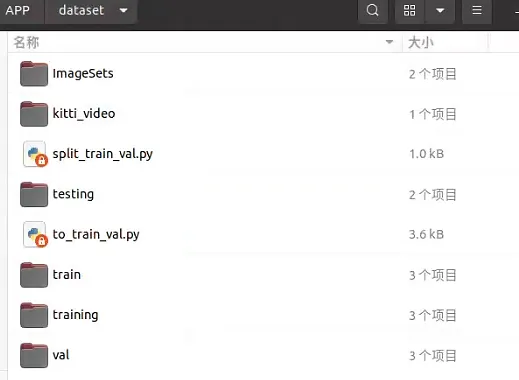
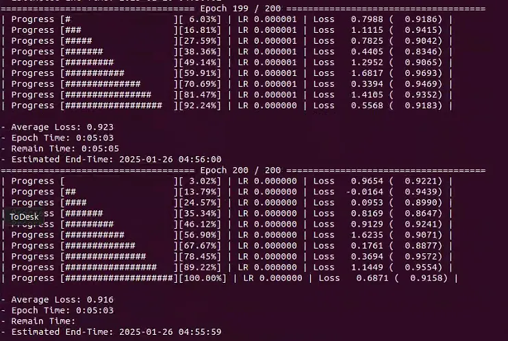
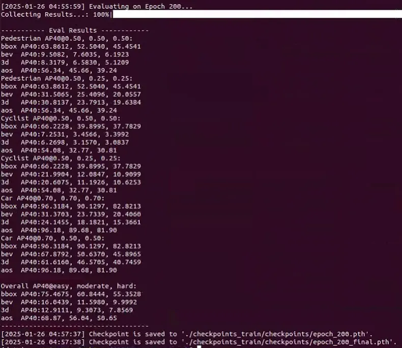
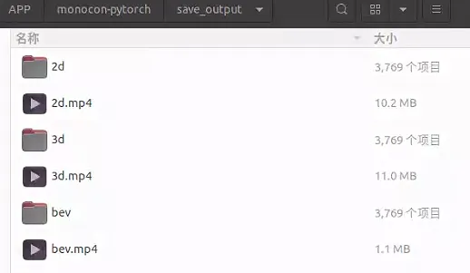
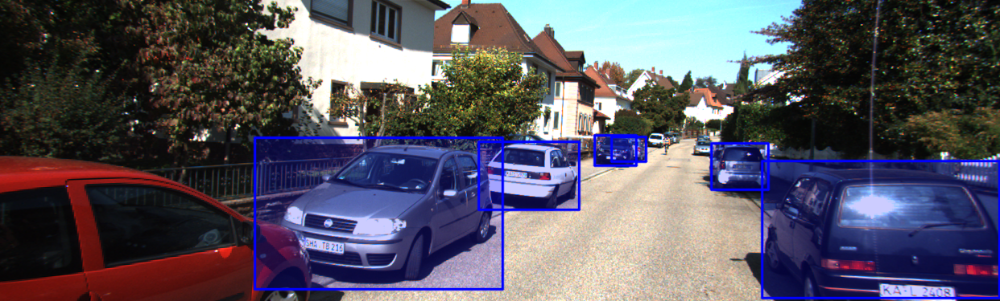
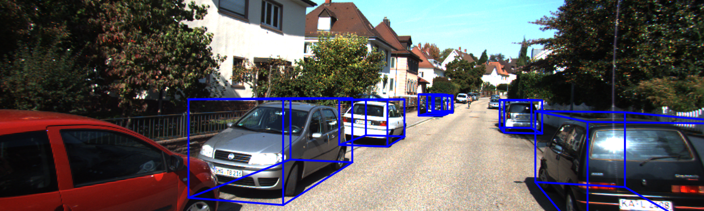
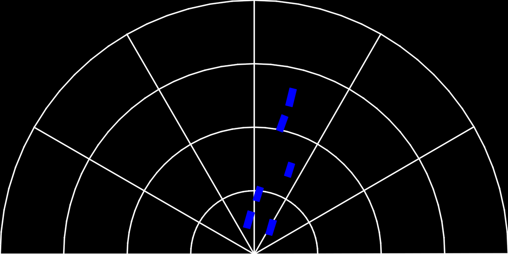

# Training, inference, and visualization of 3D and BEV effects using the MonoCon model.

 
 

## Features
Unchecked items are currently being prepared.  
(Currently, we only have a single GPU, so implementation for Multi-GPU is limited for now.)
- [x] Single-GPU Training
- [x] KITTI Evaluation
- [x] Visualization (2D Bounding Box + Projected 3D Bounding Box)
- [x] Visualization (Bird Eye's View)
- [x] Video Inference using KITTI Raw Data Sequences


## Preparations

### Setup
```bash
# [Step 1]: Create new conda environment and activate.
conda create --name MonoCon python=3.8
conda activate MonoCon

# [Step 2]: Clone this repository and change directory.
git clone https://github.com/2gunsu/monocon-pytorch
cd monocon-pytorch

# [Step 3]: See https://pytorch.org/get-started/locally/ and install 
pip install torch==1.13.1+cu117 torchvision==0.14.1+cu117 torchaudio==0.13.1 --extra-index-url https://download.pytorch.org/whl/cu117

# [Step 4]: Install some packages using 'requirements.txt' in the repository.
#           The version of numpy must be 1.22.4.
cd monocon-pytorch
pip install -r requirements.txt  -i https://pypi.tuna.tsinghua.edu.cn/simple
```

### Environments
We have tested our code in the following environments.  

| OS                 | Python       | Pytorch      | CUDA         | GPU                   | NVIDIA Driver |
| :----------------: | :----------: | :----------: | :----------: | :-------------------: | :-----------: |
| Ubuntu 20.04.6 LTS | 3.8.20       | 1.13.1       | 11.7         | NVIDIA RTX 3090       | 545.23.06     |


## Dataset
### KITTI 3D Object Detection Dataset
Please download **KITTI dataset** from [here](http://www.cvlibs.net/datasets/kitti/eval_object.php?obj_benchmark=3d).  
Click the three items below from the link to download it and unzip it into the same folder.
- Download left color images of object data set (12 GB)
- Download camera calibration matrices of object data set (16 MB)
- Download training labels of object data set (5 MB)

The structure of the data files should be as below.
```bash
[ROOT]
│
├── training
│   ├── calib
│   │   ├── 000000.txt
│   │   ├── 000001.txt
│   │   └── ...
│   ├── image_2
│   │   ├── 000000.png
│   │   ├── 000001.png
│   │   └── ...
│   └── label_2
│       ├── 000000.txt
│       ├── 000001.txt
│       └── ...
│
└── testing
    ├── calib
    └── image_2
```
### Dataset split: 
Use the script split_train_val.py to generate train.txt and val.txt, and use the script to_train_val.py to split the labeled training data (7481 frames) into train (3712 frames) and val (3769 frames).
 

## Usage
### Training
Just edit the items in ```config/monocon_configs.py``` before execution.  
```bash
python train.py
```
```bash
• The dataset path needs to be modified.
• The path for saving the model during training, such as ./checkpoints_train, create a checkpoints_train folder.
• If the GPU memory is less than 16GB, set _C.USE_BENCHMARK to False; if it's around 16GB, set it to True.
• Set the BATCH_SIZE, default _C.DATA.BATCH_SIZE = 8.
• Set the number of CPU threads, default _C.DATA.NUM_WORKERS = 4.
• Set the interval for validating the model and saving the model, default _C.PERIOD.EVAL_PERIOD = 10.
```
 


### Evaluation
```bash
python test.py  --config_file       [FILL]      # Config file (.yaml file)
                --checkpoint_file   [FILL]      # Checkpoint file (.pth file)
                --gpu_id            [Optional]  # Index of GPU to use for testing (Default: 0)
                --evaluate                      # Perform evaluation (Quantitative Results)
```
 

### Inference
```bash
python test.py  --config_file       [FILL]      # Config file (.yaml file)
                --checkpoint_file   [FILL]      # Checkpoint file (.pth file)
                --visualize                     # Perform visualization (Qualitative Results)
                --gpu_id            [Optional]  # Index of GPU to use for testing (Default: 0)
                --save_dir          [FILL]      # Path where visualization results will be saved to
```
```bash
python test.py --config_file checkpoints_train/config.yaml --checkpoint_file checkpoints_train/checkpoints/epoch_200_final.pth --visualize --save_dir save_output --gpu_id 0
```
 

### Video Inference on KITTI Raw Dataset
The KITTI Raw Dataset can be downloaded by scene from [here](https://www.cvlibs.net/datasets/kitti/raw_data.php?type=city). (You will probably need to log in.)  
There are 4 download links for each scene, of which, please download only **"synced+rectified data"** and **"calibration"**.
```bash
python test_raw.py  --data_dir          [FILL]      # Path where sequence images are saved
                    --calib_file        [FILL]      # Calibration file ("calib_cam_to_cam.txt")
                    --checkpoint_file   [FILL]      # Checkpoint file (.pth file)
                    --gpu_id            [Optional]  # Index of GPU to use for testing (Default: 0)
                    --fps               [Optional]  # FPS of the result video (Default: 25)
                    --save_dir          [FILL]      # Path of the directory to save the result video
```
```bash
python test_raw.py --data_dir /APP/dataset/kitti_video/2011_09_26/2011_09_26_drive_0005_sync/image_00/data --calib_file /APP/dataset/kitti_video/2011_09_26/calib_cam_to_cam.txt --checkpoint_file checkpoints_train/checkpoints/epoch_200_final.pth --gpu_id 0 --fps 25 --save_dir save_output 
```

## Qualitative Results  
Visualizations for 2D Boxes, 3D Boxes, and BEV, respectively, from top to bottom for each sample.  
- **000008.png** (Validation Set)  

  
   


## References
The following repositorie was referred.  
- [monocon-pytorch](https://github.com/2gunsu/monocon-pytorch)
